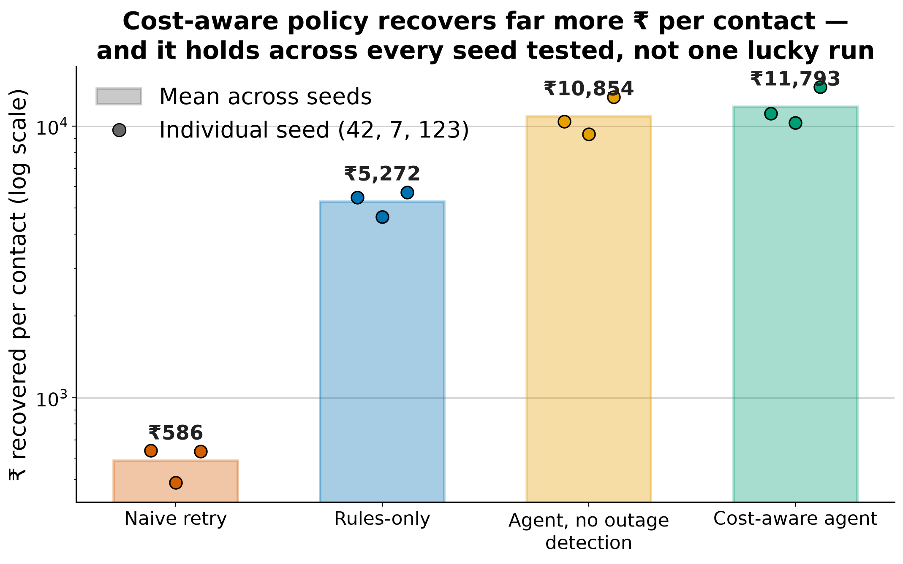

# Revenue Recovery Agent

Built for the Razorpay AI Buildathon 2026 — Track 03, AI Revenue Recovery.

## Scope

This system recovers **failed one-time payments** and **failed UPI mandate debits** for a single synthetic merchant. Given a failed payment, it diagnoses why it failed, chooses one bounded recovery action from a fixed menu, executes it against Razorpay's test-mode APIs, and measures how much money it actually recovers compared to a naive fixed-retry baseline.

Explicitly out of scope: checkout abandonment, B2B receivables, voice channel, subscription lifecycle beyond mandate retry. These are natural extensions, not gaps — see `DECISIONS.md`.

## Results

**`full_agent` recovers roughly 2.0–2.4x more ₹ per customer contact than taxonomy-only routing (`rules_only`), and 17–22x more than a naive fixed-retry baseline — consistently, on every one of the three seeds below, not a single lucky run.**



**₹ recovered per customer contact — the primary metric (`sum(recovered) / count(contacts)`; see `docs/eval_protocol_and_simulator_spec.md` §2):**

| Policy | Seed 42 | Seed 7 | Seed 123 |
|---|---:|---:|---:|
| `do_nothing` | — (0 contacts) | — (0 contacts) | — (0 contacts) |
| `naive_fixed_retry` | ₹639 | ₹487 | ₹633 |
| `rules_only` | ₹5,464 | ₹4,643 | ₹5,709 |
| `full_agent` | **₹11,131** | **₹10,309** | **₹13,940** |

**Total ₹ recovered — secondary, reported alongside the primary metric, not optimized in isolation:**

| Policy | Seed 42 | Seed 7 | Seed 123 |
|---|---:|---:|---:|
| `do_nothing` | ₹0 | ₹0 | ₹0 |
| `naive_fixed_retry` | ₹9,41,389 | ₹7,17,269 | ₹9,32,882 |
| `rules_only` | ₹12,02,031 | ₹10,16,740 | ₹11,81,842 |
| `full_agent` | ₹11,90,978 | ₹10,20,573 | **₹12,96,449** |

One honest wrinkle, named rather than left for a reviewer to find: on seed 42, `full_agent` recovers about 0.9% *less* in absolute ₹ than `rules_only` (₹11,90,978 vs ₹12,02,031). It makes less than half the contacts (107 vs 220) and correctly declines to chase lower-probability payments that would have padded the total but hurt ₹/contact — the metric this system is actually optimized for, not the one it would look best on if it chased everything. Full precision, every policy, every ablation, all three seeds: `DECISIONS.md`.

## Limitations

Stated up front, not as "future work" — the same discipline the rest of this repo applies to its own audit trail: a claim is only as credible as the gaps stated next to it.

- **Single merchant, single currency, no multi-tenancy.** There is no `merchant_id`/`tenant_id` anywhere in the schema. Every number above is one synthetic merchant's data, in INR only.
- **5 of 6 action types are simulated sends.** Only `send_payment_link` calls a real Razorpay test-mode API. `retry_now`, `retry_scheduled`, `send_nudge`, `send_instrument_update_link`, and `escalate_alternate_instrument` are logged and tagged `simulated: True` — nothing is actually sent.
- **No client-side rate limiting or backpressure** against Razorpay's own API limits. The outbox worker does not throttle its call rate.
- **No observability beyond Python's `logging` module.** No metrics, no tracing, no alerting — nothing pages anyone if the reconciliation poller starts finding a spike in failures.
- **`query_layer.py` is not built for production scale**, by its own module docstring's admission — unindexed lookback scans that get slower as the event log grows. SQLite is the only database this has ever been run against.
- **Policy constants are Python constants.** `DETECTOR_COUNT_THRESHOLD`, `CIRCUIT_BREAKER_PROBE_FRACTION`, `MAX_WEEKLY_CONTACTS`, and every other tunable require a code change and a deploy to move — there is no flag system and no gradual rollout.
- **No partial payments, refunds, or reversals.** The system only ever recovers or abandons a payment; nothing models a customer disputing or reversing a payment after it was recovered.
- **`RealRazorpayClient` and `RealAnthropicClient` have zero automated test coverage, by design** — every test in the suite runs against fakes. Both were verified manually exactly once (`docs/manual_webhook_verification.md`), which is also how the webhook event-id assumption was caught wrong.
- **All results above are on synthetic data this repo's author generated.** The ranking between policies, run on identical ground truth, is the claim — the absolute ₹ figures are not a claim about real-world recovery rates. See `docs/eval_protocol_and_simulator_spec.md` §5 for exactly what the simulator does and doesn't model.

## Why this shape

Recovery is treated as a sequential decision problem under a contact budget and a compliance constraint, not a classification problem. The system doesn't just flag payments at risk — it decides what to do about each one, and can choose to do nothing. See `docs/eval_protocol_and_simulator_spec.md` for how that claim is measured and what would falsify it.

## The LLM boundary

The LLM (`src/llm/`, Claude Sonnet 4.6) has exactly three jobs: draft outbound customer copy, classify a customer's reply into a closed five-value intent enum, and write a plain-language audit-trail note after a decision has already been made. It never decides what action to take or whether to execute it — that's `decide()` (`src/simulator/full_agent.py`), a deterministic policy that never calls the LLM.

The proof isn't a claim in this paragraph — it's `tests/test_llm_fallback.py`, which runs the entire 3-seed policy comparison with an LLM client that raises on every single call and asserts it produces the exact same ₹/contact numbers and the exact same policy ranking as with a working client. And in the comparison itself, `full_agent` and `full_agent_minus_llm` come out **identical on every decision metric — by construction, not by omission.** That's not a limitation of the ablation; it's the demonstration. Nothing in the ground-truth simulation has a parameter for message quality, and `decide()`'s code path never imports anything from `src/llm/`, so there is no mechanism by which the LLM *could* move ₹/contact even if it tried. What differs between the two is exactly what should differ: LLM cost (real vs. zero) and the actual drafted message/diagnosis text (LLM-authored vs. template) — reported honestly in the harness output, not smoothed over.

## Status

See `DECISIONS.md` for a running log of what's been decided and why, and `docs/INCIDENTS.md` for what broke along the way and how it got fixed.

## Setup

```bash
make install   # creates .venv, installs requirements.txt
make test      # 245+ tests, no network, no keys needed
make demo      # seeded end-to-end run through the real execution pipeline
make reply-demo  # a customer replies STOP -> durable opt-out -> vetoes the customer's next decide()
make crash-demo  # kills a worker mid-dispatch with a real SIGKILL, restarts it, reconciles the result
make charts    # regenerates the three evaluation charts in docs/charts/
```

`make test`, `make demo`, `make reply-demo`, and `make crash-demo` run entirely against `FakeRazorpayClient`/`FakeLLMClient` — no network calls, no keys required. Real keys (`.env`, from `.env.example`) are only needed for the two manual-verification scripts under `src/execution/` (`create_demo_link.py`, `run_webhook_server.py`) that were used once to verify the real API's actual shape — see `docs/manual_webhook_verification.md`. Nothing in the automated test suite, the demo, or the charts depends on them.

No web UI or dashboard — deliberate, not unbuilt. See `DECISIONS.md`.
